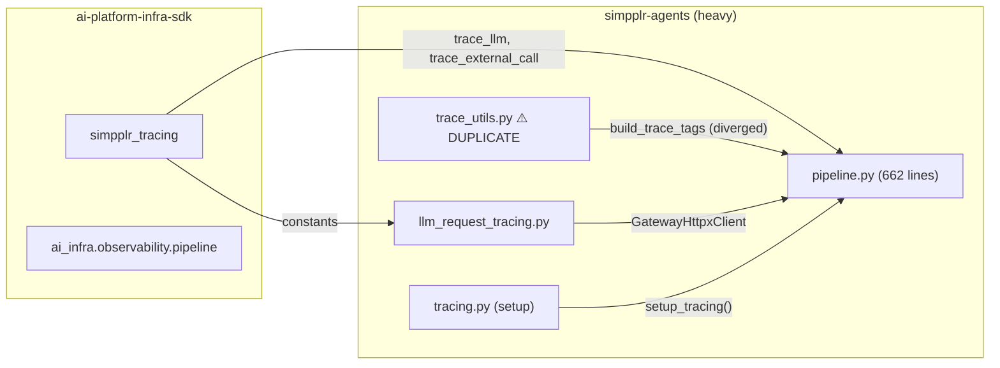
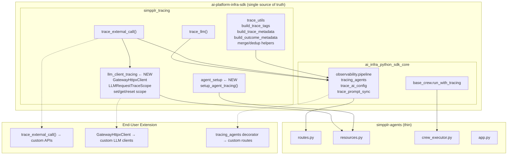

# Tracing Migration: simpplr-agents → ai-platform-infra-sdk

## Problem

Tracing code is duplicated across `simpplr-agents` and `ai-platform-infra-sdk`. Functions like `build_trace_tags` have diverged. Mandatory tracing logic (LLM spans, config-fetch spans, gateway client) lives in the app layer instead of the SDK, forcing every new service to copy-paste.

---

## Current State



**Key issues:**
- `trace_utils.py` exists in both repos; `build_trace_tags` signatures and output formats differ
- `GatewayHttpxClient` (mandatory for LLM tracing) is stuck inside simpplr-agents
- `setup_tracing()` is not reusable by other services
- End users cannot import LLM tracing helpers from the SDK

---

## Target State



---

## What Moves vs. What Stays

### Moves to SDK

| Code | From | To (SDK) | Why |
|------|------|----------|-----|
| `build_trace_tags` (enriched) | `simpplr-agents/trace_utils.py` | `simpplr_tracing.trace_utils` | Eliminate divergence, single format |
| Tag dedup helpers | `simpplr-agents/trace_utils.py` | `simpplr_tracing.trace_utils` | Generic, reusable |
| `GatewayHttpxClient` + scope | `simpplr-agents/llm_request_tracing.py` | `simpplr_tracing.llm_client_tracing` | Mandatory for every agent service |
| `setup_tracing()` | `simpplr-agents/tracing.py` | `simpplr_tracing.agent_setup` | Identical init across all services |

### Stays in simpplr-agents

| Code | Why |
|------|-----|
| `routes.py`, `app.py` | App-specific wiring |
| `crew_executor.py`, `langfuse_retry.py` | App-specific retry/error handling |
| `resources.py` (startup lifecycle) | App-specific resource management |

---

## Migration Phases

```mermaid
gantt
  title Migration Phases
  dateFormat X
  axisFormat %s

  section SDK Changes
  Phase1_ConsolidateTraceUtils :p1, 0, 1
  Phase2_MoveLlmClientTracing  :p2, after p1, 1
  Phase3_MoveSetupTracing      :p3, after p1, 1

  section simpplr-agents
  Phase4_ThinOut          :p4, after p2, 1
  Phase5_ExportsAndVersion :p5, after p4, 1
  Phase6_MigrateTests     :p6, after p5, 1
```



| Phase | Action | Key Detail |
|-------|--------|------------|
| 1 | Consolidate `trace_utils` | Upgrade SDK's `build_trace_tags` to `x-smtip-*:value` format; add `parse_trace_tag_pair`, `merge_trace_tags_without_duplicate_semantics` |
| 2 | Create `simpplr_tracing.llm_client_tracing` | Move `GatewayHttpxClient`, `LLMRequestTraceScope`; refactor `set_llm_request_trace_scope` to accept **kwargs** instead of `AgentExecutionContext` (avoids circular dep) |
| 3 | Create `simpplr_tracing.agent_setup` | Move `setup_tracing()` as parameterized `setup_agent_tracing(service_name, ...)` |
| 4 | Thin out simpplr-agents | Delete `trace_utils.py`; replace `llm_request_tracing.py` and `tracing.py` with thin re-imports |
| 5 | Version bump | `simpplr-python-tracing` 2.5.0 → 2.6.0; update `simpplr-agents` pin |
| 6 | Move tests | `test_llm_request_tracing.py`, `test_tracing_init.py` → SDK test suite |

---

## End-User Extensibility

```mermaid
graph LR
  subgraph auto["Automatic (zero code)"]
    A1["trace_llm root span"]
    A2["Config fetch span"]
    A3["LLM gateway spans"]
  end

  subgraph call["Import and Call"]
    B1["trace_external_call()\nfor custom external APIs"]
    B2["build_trace_tags()\nwith custom **kwargs"]
  end

  subgraph compose["Advanced Composition"]
    C1["@tracing_agents\n@trace_ai_config\non custom FastAPI routes"]
    C2["GatewayHttpxClient\nfor non-standard LLM clients"]
  end

  auto --> call --> compose
```

**Example** -- tracing a custom vector DB call:

```python
from simpplr_tracing import trace_external_call

with trace_external_call(name="VectorDBSearch", call_type="api", trace_id=ctx.trace_id) as obs:
    result = await vector_db.search(query)
    obs.update(output=str(result))
```

---

## Benefits

| Benefit | Detail |
|---------|--------|
| No duplication | Single `trace_utils.py`, single `build_trace_tags` format |
| Lightweight simpplr-agents | ~800 lines of tracing code removed; only thin imports remain |
| Reusable across services | Any new agent service gets LLM tracing, setup, pipeline decorators from SDK |
| User extensibility | `trace_external_call`, `GatewayHttpxClient`, pipeline decorators all importable |
| No circular deps | `set_llm_request_trace_scope` takes kwargs, not `AgentExecutionContext` |
| Backward compatible | Re-export shims in simpplr-agents; minor SDK version bump (additive API) |

---

## Risks

| Risk | Mitigation |
|------|------------|
| `build_trace_tags` format change breaks SDK consumers | Check downstream usage; add `format` parameter if needed |
| `simpplr_tracing` → `simpplr_agent_runtime` circular dep | Refactor to keyword args; no runtime import |
| Test coverage gap during migration | Move tests alongside code; run both suites in CI |
