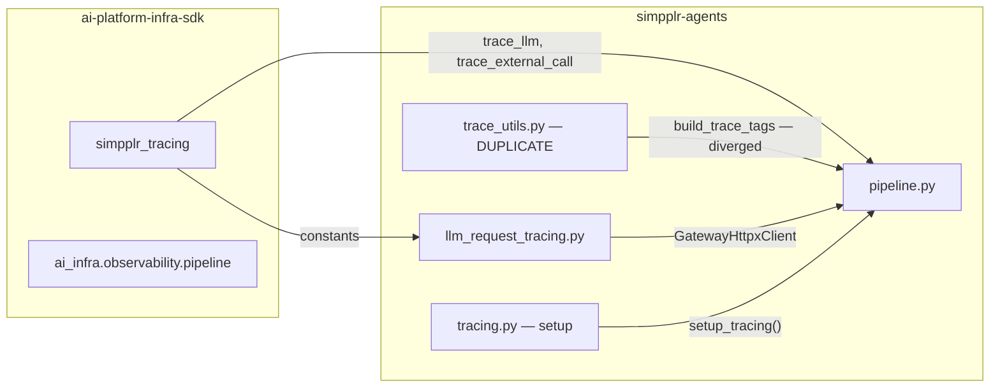
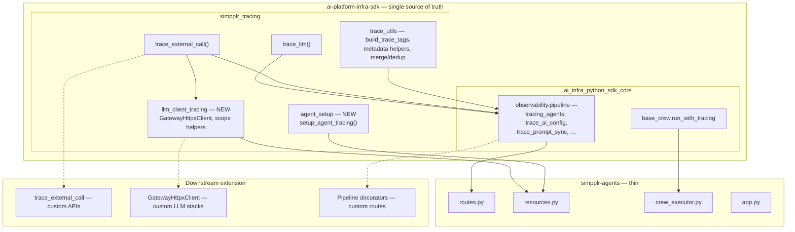

# Tracing migration architecture

**Summary:** We're consolidating duplicated tracing logic into **ai-platform-infra-sdk** (`simpplr_tracing` and core observability modules) so **simpplr-agents** stays a thin FastAPI/CrewAI shell. New agent services import one SDK instead of copying `trace_utils`, LLM gateway tracing, and OTEL setup.

**Last updated:** 2026-04-22

---

## Why we're doing this

Tracing code exists in two places today: the SDK and simpplr-agents. `build_trace_tags` and related helpers have **diverged** (different tag string formats and fields). Mandatory pieces—LLM gateway spans (`GatewayHttpxClient`), trace tag construction, and Langfuse/OTEL bootstrap—live in the app repo, so every new service tends to copy-paste rather than reuse.

The goal is a **single source of truth** in the SDK, **additive** public APIs for extensions (`trace_external_call`, decorators, gateway client), and **thin shims** in simpplr-agents until callers migrate imports.

---

## Current state



**Problems:**

| Issue | Impact |
|-------|--------|
| Two `trace_utils` implementations | Different `build_trace_tags` signatures and tag formats (`key : value` vs enriched `x-smtip-key:value`). |
| `GatewayHttpxClient` only in agents | Mandatory LLM tracing cannot be imported from the SDK. |
| `setup_tracing()` only in agents | Same bootstrap copied or forked per service. |
| Heavy `pipeline.py` in agents | Large FastAPI/DI surface that should converge with SDK `observability.pipeline`. |

---

## Target state



**Intent:**

- **`simpplr_tracing.trace_utils`** owns the enriched SMTIP tag format and dedup helpers (`parse_trace_tag_pair`, `merge_trace_tags_without_duplicate_semantics`, etc.).
- **`simpplr_tracing.llm_client_tracing`** owns gateway HTTPX wrapping and request trace scope (no dependency on agents-specific types).
- **`simpplr_tracing.agent_setup`** exposes parameterized `setup_agent_tracing(service_name, …)` instead of a agents-local `setup_tracing()`.
- **simpplr-agents** keeps app wiring only: routes, resources lifecycle, crew execution quirks, `app.py`.

---

## What moves vs. what stays

### Moves into the SDK

| Code | From | To | Rationale |
|------|------|-----|-----------|
| Enriched `build_trace_tags`, dedup helpers | `simpplr-agents/.../trace_utils.py` | `simpplr_tracing.trace_utils` | One format (`x-smtip-*:value` taxonomy aligned with headers and tests). |
| `GatewayHttpxClient`, `LLMRequestTraceScope`, scope setters | `simpplr-agents/llm_request_tracing.py` | `simpplr_tracing.llm_client_tracing` | Required for every agent that calls the LLM gateway. |
| `setup_tracing()` | `simpplr-agents/tracing.py` | `simpplr_tracing.agent_setup` as `setup_agent_tracing(...)` | Shared OTEL + Langfuse + CrewAI init. |

Functions already in the SDK (`trace_llm`, `trace_external_call`, pipeline decorators in `ai_infra.observability.pipeline`) stay there; simpplr-agents continues to consume them via imports, not forks.

### Stays in simpplr-agents

| Area | Why |
|------|-----|
| `routes.py`, `app.py` | Route registration, middleware order, service-specific DI. |
| `resources.py` | Startup/shutdown and resource lifecycle for this app. |
| `crew_executor.py`, `langfuse_retry.py` | Retry and execution behavior specific to simpplr-agents. |

After migration, optional **re-export shims** (thin modules that re-import from the SDK) can preserve old import paths for a deprecation window.

---

## Migration phases

Phases are ordered to avoid circular imports and to land test coverage with the code.

```mermaid
gantt
  title Tracing migration — dependency order
  dateFormat X
  axisFormat %s

  section SDK
  P1_trace_utils       :p1, 0, 1
  P2_llm_client        :p2, after p1, 1
  P3_agent_setup       :p3, after p1, 1

  section simpplr-agents
  P4_thin_agents       :p4, after p2, 1
  P5_version_exports   :p5, after p4, 1
  P6_tests               :p6, after p5, 1
```



| Phase | Work | Notes |
|-------|------|--------|
| **1** | Consolidate `trace_utils` in the SDK | Align `build_trace_tags` with enriched `x-smtip-*` strings; add `parse_trace_tag_pair`, `merge_trace_tags_without_duplicate_semantics`, and related helpers from agents. |
| **2** | Add `simpplr_tracing.llm_client_tracing` | Move `GatewayHttpxClient` and `LLMRequestTraceScope`; implement `set_llm_request_trace_scope` with **keyword arguments** instead of `AgentExecutionContext` to avoid SDK ↔ runtime cycles. |
| **3** | Add `simpplr_tracing.agent_setup` | Move setup as `setup_agent_tracing(service_name, …)` with env-driven config. |
| **4** | Thin simpplr-agents | Remove duplicate `trace_utils.py`; replace `llm_request_tracing.py` and `tracing.py` with thin imports (or shims). |
| **5** | Versioning and exports | Bump `simpplr-python-tracing` (e.g. 2.5.0 → 2.6.0), update `simpplr-agents` pin, refresh `__init__` exports. |
| **6** | Tests | Move `test_llm_request_tracing.py`, `test_tracing_init.py` (and related) into the SDK suite; adjust agents tests to import from the SDK. |

---

## Downstream extensibility

```mermaid
graph LR
  subgraph auto["Automatic"]
    A1["trace_llm root span"]
    A2["Config fetch via trace_external_call"]
    A3["LLM gateway spans"]
  end

  subgraph call["Explicit calls"]
    B1["trace_external_call for non-LLM deps"]
    B2["build_trace_tags with extra kwargs"]
  end

  subgraph compose["Composition"]
    C1["Decorators on custom FastAPI routes"]
    C2["GatewayHttpxClient for alternate clients"]
  end

  auto --> call --> compose
```

**Example — external dependency:**

```python
from simpplr_tracing import trace_external_call

with trace_external_call(name="VectorDBSearch", call_type="api", trace_id=ctx.trace_id) as obs:
    result = await vector_db.search(query)
    obs.update(output=str(result))
```

---

## Benefits

| Benefit | Description |
|---------|-------------|
| Single implementation | One `build_trace_tags` contract and one set of dedup rules. |
| Smaller agents repo | Large tracing modules removed from simpplr-agents; imports stay stable via shims if needed. |
| Easier new services | Import tracing, setup, and pipeline helpers from the SDK package set. |
| Controlled coupling | Keyword-arg scope APIs avoid `simpplr_tracing` ↔ `simpplr_agent_runtime` import cycles. |
| Additive SDK bump | Prefer minor version with backward-compatible exports. |

---

## Risks and mitigations

| Risk | Mitigation |
|------|------------|
| Tag format change breaks consumers | Audit downstream usage before flip; optional `format` parameter or dual-write period if required. |
| Circular dependencies | Keep LLM scope and setup free of agents-only types; use kwargs and lazy imports where needed. |
| Coverage gap during moves | Move tests with modules; run SDK and agents CI until both are green. |

---

## Related material

- Detailed task breakdown and file paths: `.cursor/plans/tracing_code_migration_plan_a40d71b2.plan.md`
